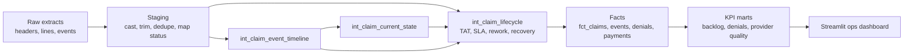
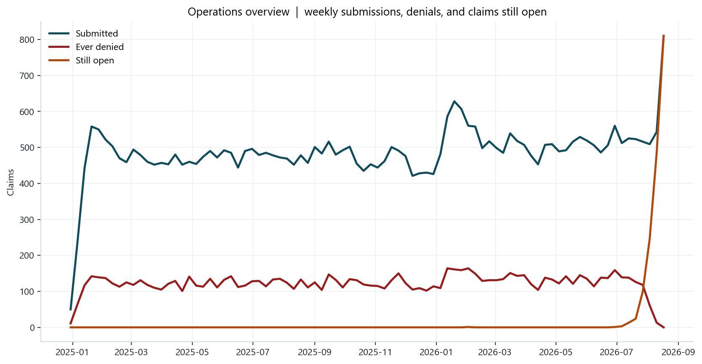
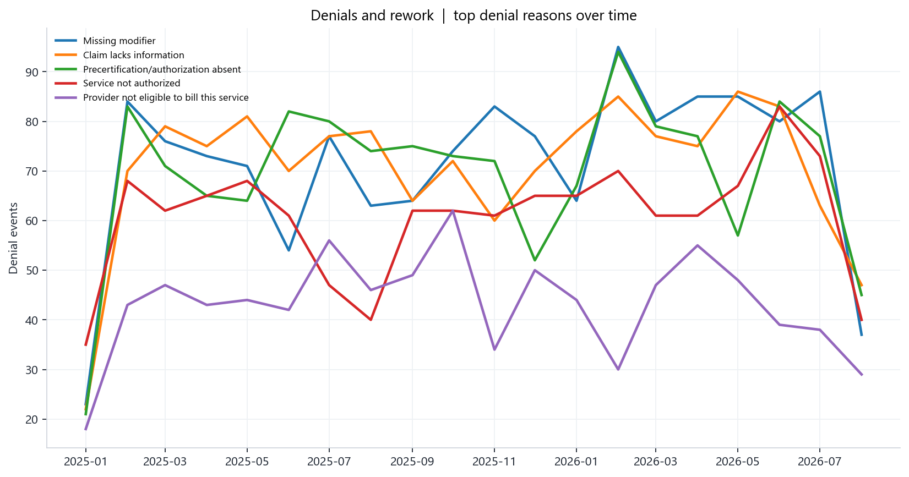
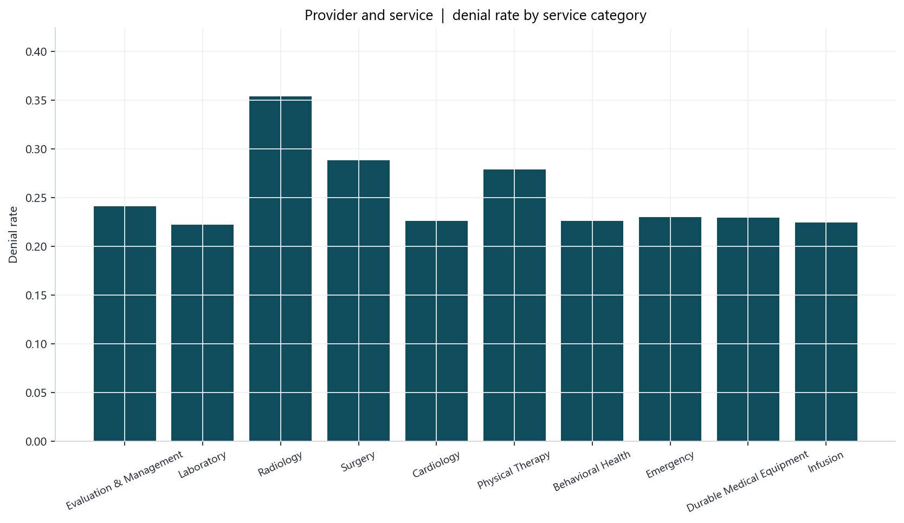
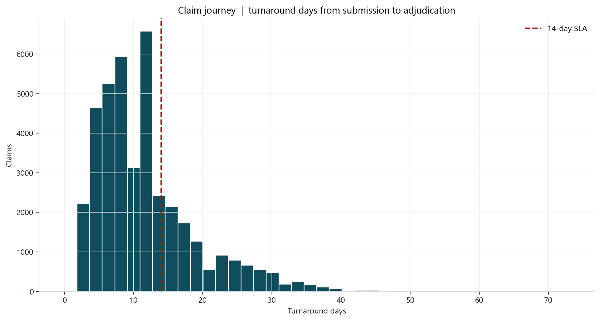

# Claims Operations Analytics Platform

[](https://www.python.org/downloads/release/python-3120/)
[](https://ubuntu.com/engage/mlops-guide)
[](https://www.postgresql.org/docs/18/index.html)
[](https://github.com/A-Kuo/Claims-Operations-Analytics-Platform/actions/workflows/ci.yml)

An end-to-end analytics project that models the claims lifecycle from submission through adjudication and payment, turning raw operational events into validated KPI dashboards for backlog, denial, turnaround-time, and provider-performance analysis.

This project is a business-facing data product: raw claims and adjudication data are cleaned, standardized, tested, and transformed into warehouse-style marts that support operations teams and analysts.

**The data is synthetic.** Identifiers, providers, payers, and amounts do not represent real patients or organizations. The value of the project is the modeling, data-quality work, KPI definitions, and operational interpretation.

All processing runs on a local DuckDB file. Nothing is sent to a cloud warehouse unless you choose to push the repo yourself.

## At a glance

Claims examiners work off a messy status field, and this platform rebuilds true claim state from a 178,073-row raw event log to expose backlog, denial, and payment-lag risk against Northstar's 14-day SLA. The stack is dbt Core and DuckDB, structured as a star schema of 5 facts, 6 dimensions, and 11 KPI marts feeding a Streamlit dashboard, with a Supabase/Postgres raw-ingestion layer being built alongside it. The evidence is 83 dbt tests gated in CI on every push and pull request, plus a separate CI job that validates the Postgres ingestion path end-to-end against a live container.

The DuckDB and dbt pipeline is stable — it's the live source for every KPI and dashboard page in this repo. The Postgres/Supabase ingestion layer is still in progress: dbt now reads from it too, through a DuckDB `postgres` extension ATTACH, but only for one proof-of-concept staging model that doesn't feed any KPI or dashboard yet. See [Migration status](#migration-status-duckdb-stable-vs-postgressupabase-in-progress) below for exactly where that stands.

## Who uses this

Northstar Health Plan operations leadership, claims examiners, provider relations, and analytics engineers.

The platform supports five decisions:

1. Where open inventory is aging past the 14-day adjudication SLA.
2. Which denial reasons are worth a coding or authorization intervention.
3. Which provider groups produce avoidable rework.
4. Which payer contracts drag payment lag past the 7-day target.
5. Which service categories (radiology, behavioral health, surgery) need queue redesign.

## Top KPIs

| KPI | Result in this build | Definition |
| --- | --- | --- |
| Claim volume | 41,915 eligible claims | Deduplicated headers after staging |
| Open backlog | 1,682 claims | No terminal adjudication event yet |
| Average turnaround | 11.8 days | Submission date to last adjudication date |
| Denial rate | 25.0% | Claims with at least one denial event |
| Rework rate | 24.5% | Pended, resubmitted, or header rework flag |
| First-pass resolution | 59.3% | Approved or paid with no rework |
| SLA breach rate | 24.4% | Open >14 days, or adjudicated after 14 days |
| Payment lag | 12.5 days | Adjudication to first payment |
| Paid-to-billed (paid claims) | 63.2% | Paid amount / billed amount |

Full logic lives in [docs/metric_dictionary.md](docs/metric_dictionary.md).

## Screenshots


## Business pain point

Northstar set a **14-day first-pass adjudication SLA** and a **7-day payment SLA** after approval. Examiners still work from status lists in the claims system. Those lists mix aliases (`APPR`, `adj-denied`, `pending info`), duplicate extract reloads, and header dates that disagree with the event log. The result: backlog hides in "in review," authorization denials recycle through Summit Orthopedics and Lakeside Imaging, and Heartland Medicaid payment lag sits at 23 days against a 7-day target.

## Architecture

```text
CSV extracts (synthetic)          DuckDB warehouse (local)
data/raw/*.csv                    target/claims_ops.duckdb
        |                                  ^
        v                                  |
scripts/generate_raw_data.py               |
scripts/load_raw.py  ----------------------+
                                           |
dbt Core                                   |
  seeds (status / event crosswalks)        |
  staging  ->  intermediate  ->  marts     |
                                           |
Streamlit dashboard  <---- marts.fct_* / mart_*
dashboards/app.py
```



Current status comes from the **latest canonical event**, not the messy header status field. Header dates are fallbacks only.

## Migration status: DuckDB (stable) vs. Postgres/Supabase (in progress)

The DuckDB and dbt pipeline is finished and stable. It's CI-tested on every push through the `dbt` job, which runs `dbt seed`, `dbt run`, and `dbt test` against DuckDB and passes all 83 tests. This is the pipeline behind every mart and every dashboard page in this repo today.

The Postgres/Supabase ingestion layer is real, but it isn't load-bearing yet. The schema migrations live in `supabase/migrations/` (schema creation, raw table DDL, indexes), the seed crosswalks live in `supabase/seeds/`, and the load path is `scripts/build_postgres_extracts.py` followed by `scripts/load_raw_to_postgres.py` and `scripts/validate_postgres_load.py`. A separate CI job, `supabase-postgres`, spins up a real Postgres container and runs that whole path — generate, transform, load, validate — on every push, and it passes.

dbt can now read from that live Postgres container too. The `ci_pg` profile target uses DuckDB's `postgres` extension to `ATTACH` the Supabase database directly, so dbt-duckdb queries it as an ordinary source without a separate Postgres adapter. One model, `stg_claim_headers_pg` in `models/staging_postgres/` (materialized into its own `postgres_staging` DuckDB schema, kept separate from the CSV-sourced `staging` schema), proves the mechanism end to end and is run and tested in the `supabase-postgres` CI job via `dbt run --target ci_pg` and `dbt test --target ci_pg`. It reads `raw.claim_headers` from Postgres, casts and trims a few columns, and does nothing else — it isn't joined into any intermediate model, mart, or KPI. `models/staging/_sources.yml`, the source behind every mart and every dashboard number, still points only at the DuckDB `raw` schema loaded from CSVs. DuckDB remains the single source of truth for every number in this README; the Postgres attachment is a proven bridge, not yet a used one.

## Project layout

```text
├── README.md
├── data/raw/                 # generated CSVs, gitignored
├── seeds/                    # status and event-type crosswalks
├── models/staging/
├── models/intermediate/
├── models/marts/core/        # dims and facts
├── models/marts/metrics/     # dashboard-ready marts
├── dashboards/app.py
├── analyses/                 # ops memo and analyst SQL
├── tests/
├── macros/
├── docs/
├── screenshots/
└── scripts/
```

## Local setup

Python 3.12. Work stays on disk in `target/claims_ops.duckdb`.

```powershell
py -3.12 -m venv .venv
.\.venv\Scripts\python.exe -m pip install -r requirements.txt
$env:DBT_PROFILES_DIR = (Get-Location).Path
.\.venv\Scripts\python.exe scripts\run_pipeline.py
.\.venv\Scripts\python.exe -m streamlit run dashboards/app.py
```

`run_pipeline.py` generates extracts, loads the `raw` schema, then runs `dbt deps`, `dbt seed`, `dbt run`, and `dbt test`.

To regenerate screenshots after a pipeline run:

```powershell
.\.venv\Scripts\python.exe scripts\capture_screenshots.py
```

This repo does not push anywhere. `profiles.yml` points at a local DuckDB file with no credentials.

## What the event model does

A claim is a timeline, not a single status column.

1. `stg_claim_events` maps aliases (`DENY`, `RESUB`, `check_issued`) through `event_type_crosswalk`.
2. Exact duplicate intake rows (same claim, event type, timestamp) are flagged.
3. `int_claim_event_timeline` records first submitted, first denied, first approved, first paid, last adjudication.
4. `int_claim_current_state` sets `current_status` from the latest event.
5. `int_claim_lifecycle` computes turnaround, payment lag, SLA flags, rework, first-pass resolution, and denial recovery.

That lifecycle table is the source of truth for every KPI.

## Dimensional model

**Dimensions:** `dim_member`, `dim_provider`, `dim_payer`, `dim_service`, `dim_denial_reason`, `dim_date`

**Facts:** `fct_claims`, `fct_claim_lines`, `fct_claim_events`, `fct_payments`, `fct_denials`

**KPI marts:** `mart_claims_overview_daily`, `mart_claim_backlog`, `mart_claim_backlog_by_provider`, `mart_denials_by_reason`, `mart_denial_patterns`, `mart_payment_lag_by_service`, `mart_claim_turnaround`, `mart_payment_variance`, `mart_provider_claim_quality`, `mart_provider_performance`, `mart_data_quality_exceptions`

## Data quality planted in the extract

Staging keeps the defects visible instead of silently dropping them.

| Defect | Count in this build | Handling |
| --- | --- | --- |
| Duplicate claim headers | 105 | Keep latest `ingest_ts` |
| Invalid billed amount | 85 | Flag; exclude from KPI-eligible set |
| Paid exceeds billed | 143 | Flag; retain on the fact for audit |
| Missing member_id | 43 | Map to `MBR-UNKNOWN` |
| Missing provider specialty | 18 | Label `Unknown` on `dim_provider` |

`dbt test` in this build: **83 passed** (81 data tests, 2 unit tests on current-status mapping).

## Dashboard

Four pages, filters for submission date, payer type, provider group, and service category.

1. **Operations overview.** Volume, open backlog, TAT, denial rate, payment lag, SLA breach, weekly trend, aging inventory.
2. **Denials and rework.** Reason trends, rework heatmap, highest-denial provider groups.
3. **Provider and service.** Risk buckets, denial by category, billed vs allowed vs paid, outlier providers.
4. **Claim journey.** Status funnel, event volume, failure paths, TAT distribution vs the 14-day SLA.






Walkthrough: [docs/dashboard_walkthrough.md](docs/dashboard_walkthrough.md).

## Findings in this build

The short operations memo is [analyses/operations_memo.md](analyses/operations_memo.md). The headline:

- **Lakeside Imaging** and **Summit Orthopedics** deny about **40%** of claims (authorization and missing-modifier). Greenfield Primary Care, the clean benchmark, denies **17%**.
- **Behavioral health** averages **28.2 days** TAT against a 14-day SLA. Harbor Behavioral Health holds the largest beyond-SLA open queue (38 claims).
- **Heartland Medicaid** pays in **23 days** after adjudication. Unity Health Plan pays in **7 days**.
- Top denial reasons are **CO-4 missing modifier**, **CO-16 lacks information**, and **CO-197 authorization absent**. Those are recoverable technical denials, not medical-necessity walls.

## Documentation

- [Metric dictionary](docs/metric_dictionary.md)
- [Data dictionary](docs/data_dictionary.md)
- [Dashboard walkthrough](docs/dashboard_walkthrough.md)
- [Limitations](docs/limitations.md)

## Resume framing

**Data analyst:** Built a claims analytics platform that reconstructs true claim status from a 178,073-row raw event log (not the messy header status field), driving KPI dashboards — turnaround time, denial rate, backlog, payment lag — across 41,915 KPI-eligible claims.

**Analytics engineer:** Designed a denormalized dbt star schema (5 facts, 6 dimensions, 11 KPI marts) for the claims lifecycle, denial, and payment workflows, backed by 83 dbt tests CI-gated on every push, alongside a separate CI job that validates the Postgres ingestion path end-to-end against a live container.

**Data engineer:** Built an end-to-end claims pipeline — synthetic event generation, staging, dimensional modeling, dashboard-ready marts — plus a parallel Supabase/Postgres raw-ingestion path (schema migrations, seed crosswalks, load-and-validate scripts) proven end-to-end against a real Postgres container in CI.

## License

Open
